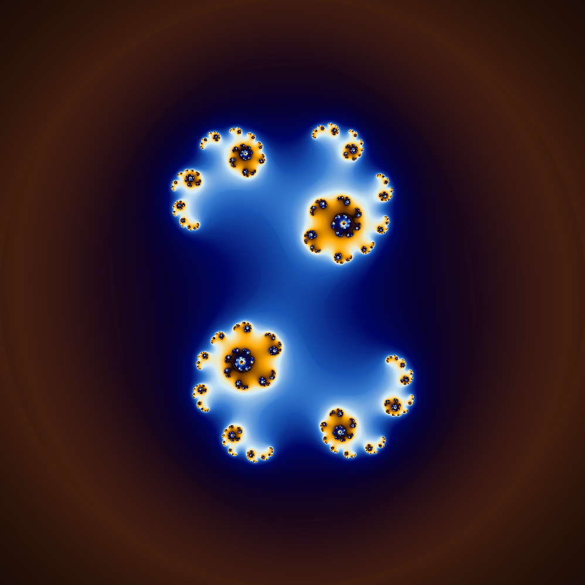
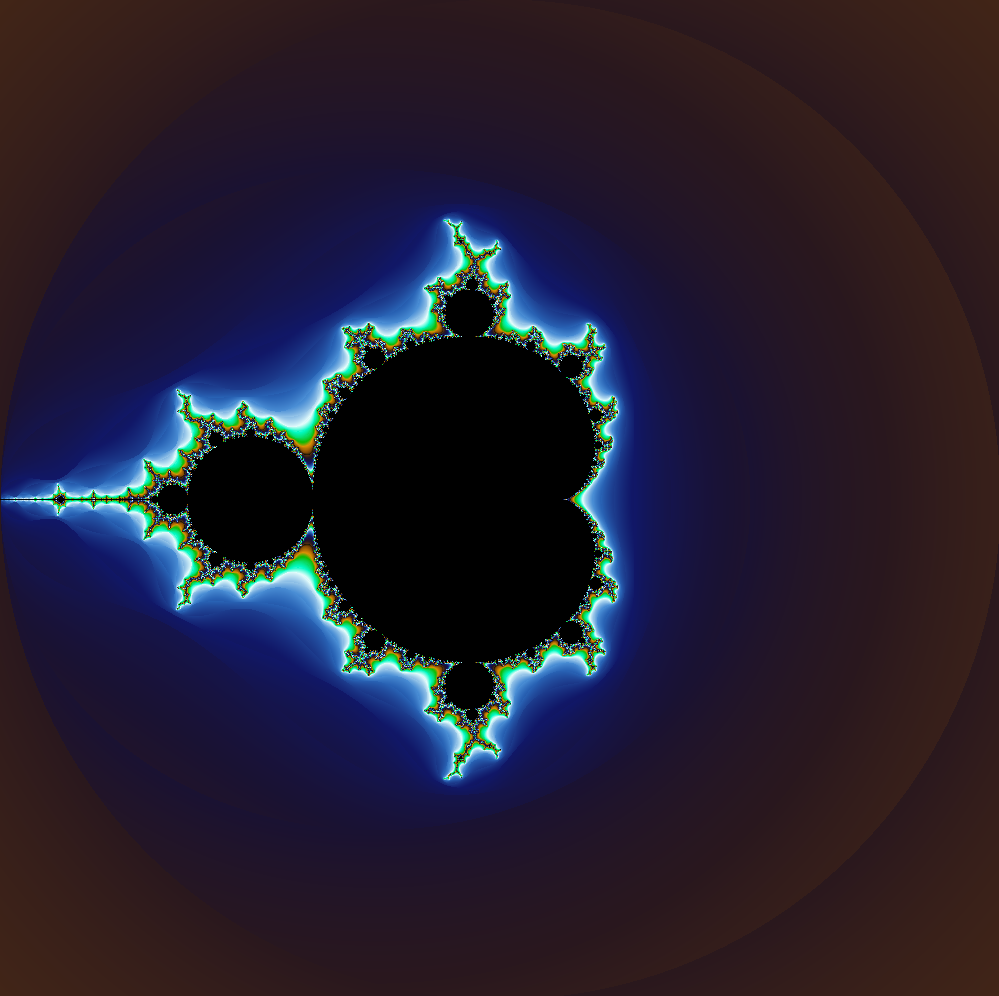

# fract-ol

## 설명

42의 그래픽 라이브러리인 [**MiniLibX**](https://harm-smits.github.io/42docs/libs/minilibx)를 이용해 [**Julia set**](https://en.wikipedia.org/wiki/Julia_set), [**Mandelbrot set**](https://en.wikipedia.org/wiki/Mandelbrot_set)과 [**Newton fractal**](https://en.wikipedia.org/wiki/Newton_fractal)을 렌더링하는 기능을 구현하는 프로젝트입니다.

적절한 하드웨어 성능이 주어진다면, 마우스 휠을 이용한 줌인과 줌아웃으로 프랙탈 구조의 특정 부분을 계속해서 확대하거나 축소할 수 있습니다.

## 실행

### 실행 예시

<p float="left">
  
   
</p>

---

윈도우(WSL 2), 맥과 리눅스 환경에서 실행할 수 있으며, 리눅스에서 실행하기 위해선 아래 명령을 실행해야 합니다.

```shell
sudo apt-get update && sudo apt-get install xorg libxext-dev zlib1g-dev libbsd-dev
```

디렉터리 내에서 `make`를 입력하면 실행 가능한 파일인 `fractol`이 생성됩니다.

### 명령행 인자

`fractol`을 실행 시 전달해야 할 명령행 인자는 다음과 같습니다:

```shell
[fractal type][escape radius][max iteration][real value][imaginary value]
```

`fractal type`은 정수 값이며 다음과 같습니다

1. Julia set
2. Mandelbrot set
3. Newton fractal

`excape radius`와 `max iteration`은 정수 값입니다.

`real value`와 `imaginary value`는 실수 값이며, `fractal type`이 1일 때만 입력합니다.

### 조작

<table>
  <tr><td><strong>Controls</strong></td><td><strong>Action</strong></td></tr>
  <tr><td><kbd>&nbsp;▲&nbsp;</kbd><kbd>&nbsp;◄&nbsp;</kbd><kbd>&nbsp;▼&nbsp;</kbd><kbd>&nbsp;►&nbsp;</kbd></td><td>이동</td></tr>
  <tr><td><kbd>&nbsp;scroll wheel&nbsp;</kbd></td><td>줌 인/아웃</td></tr>
  <tr><td><kbd>&nbsp;z&nbsp;</kbd></td><td>마우스 위치에서의 줌 인/아웃 토글</td></tr>
  <tr><td><kbd>&nbsp;c&nbsp;</kbd></td><td>사이키델릭 효과 토글</td></tr>
  <tr><td><kbd>&nbsp;esc&nbsp;</kbd></td><td>종료</td></tr>
</table>
