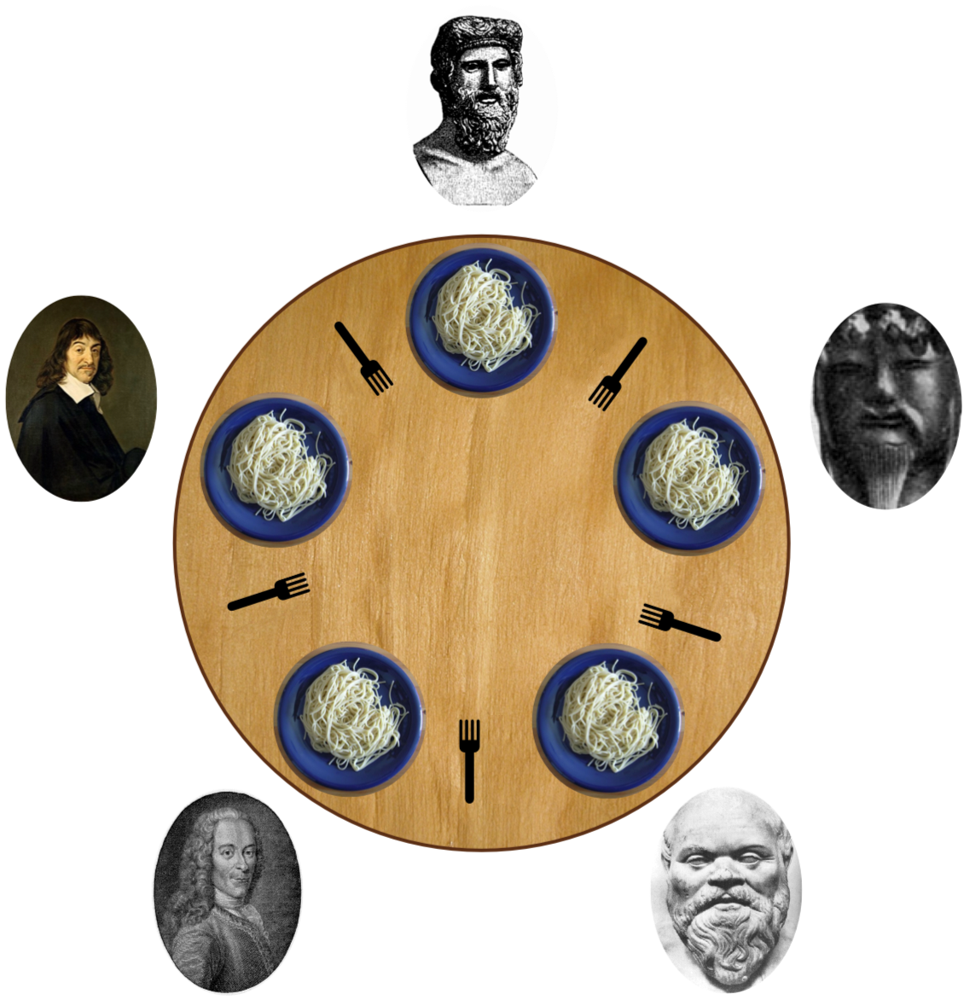

# philosophers

<p float="left">
  
</p>

---

`philo`는 이 프로젝트의 필수 구현 파트입니다. 각 철학자를 스레드로, 철학자의 포크에 대한 경쟁 상태를 방지하기 위한 락 기법으로 뮤텍스를 사용합니다.  
`philo_bonus_less_semaphores`는 보너스 구현 파트입니다. 각 철학자를 프로세스로, 철학자의 포크에 대한 경쟁 상태를 방지하기 위한 락 기법으로 세마포어를 사용합니다.

---

프로세스와 스레드, 뮤텍스와 세마포어 락을 이해하고 이를 적용해 [식사하는 철학자들 문제](https://en.wikipedia.org/wiki/Dining_philosophers_problem)를 해결하기 위한 프로젝트입니다.

프로젝트의 조건은 다음과 같습니다:

1. 한 명 이상의 철학자가 원탁에 앉아있으며, 원탁의 중앙엔 스파게티 보울 하나가 놓여있습니다.
2. 철학자의 상태는 `eat`, `think`, `sleep` 중 하나입니다.  
   식사 중에는 생각하거나 잠을 잘 수 없고, 생각할 때는 식사하거나 잠을 잘 수 없으며, 잠을 잘 때는 식사하거나 생각할 수 없습니다.
3. 테이블에는 철학자와 같은 수의 포크가 놓여있습니다.
4. 철학자는 원탁 중앙의 스파게티를 먹기 위해 한 손에 하나씩 총 두 개의 포크를 사용해야 합니다.
5. 철학자가 식사를 마치면, 포크를 원탁에 올려놓고 잠에 들고, 잠에서 깬 후엔 생각하기를 시작합니다.
6. 이러한 상황은 한 철학자가 식사를 하지 못해 굶어 죽을 때 종료됩니다.

이 프로젝트의 목표는 모든 철학자가 서로의 상태(ex. 현재 식사 중인지, 잠을 자는 중인지 또는 언제 식사를 시작했고 얼마나 남았는지 등)를 알지 못하는 상태에서 모든 철학자가 굶어 죽지 않도록 하는 것입니다.

## 실행

`philo`, `philo_bonus_less_semaphores` 디렉터리 내에서 `make`를 입력한 후, 아래를 참고해 인자를 주어 실행하면 됩니다.  
참고로 `philo` 디렉터리의 실행 파일명은 `philo`이며, `philo_bonus_less_semaphores` 디렉터리의 실행 파일명은 `philo_bonus`입니다.

```shell
./philo number_of_philosophers time_to_die time_to_eat time_to_sleep [number_of_times_each_philosophers_must_eat]
```

- `number_of_philosophers`  
  철학자의 인원 수와 포크의 수를 나타냅니다.
- `time_to_die`  
  철학자가 프로그램 시작 시각 이후 또는 마지막 식사 시작 시각 이후로 `time_to_die` 시간만큼 식사를 하지 않는다면 굶어 죽게 되는 시간을 나타냅니다.  
  밀리초 단위입니다.
- `time_to_eat`  
  철학자가 식사를 하는데 걸리는 시간을 나타내며, 이 시간동안 철학자는 두 개의 포크를 사용합니다.  
  밀리초 단위입니다.
- `time_to_sleep`  
  철학자가 잠을 자는데 사용하는 시간을 나타냅니다.  
  밀리초 단위입니다.
- `number_of_times_each_philosophers_must_eat`  
  모든 철학자가 최소한 이 값만큼 식사를 했다면 프로그램이 종료됩니다.  
  이 인자의 입력은 옵션이며, 입력하지 않았을 땐 한 철학자가 굶어 죽을 때 프로그램이 종료됩니다.

### 출력

프로그램을 실행하면 각 철학자의 상태가 다음과 같이 출력됩니다.

```shell
timestamp_in_ms X has taken a fork
timestamp_in_ms X is eating
timestamp_in_ms X is sleeping
timestamp_in_ms X is thinking
timestamp_in_ms X died
```
